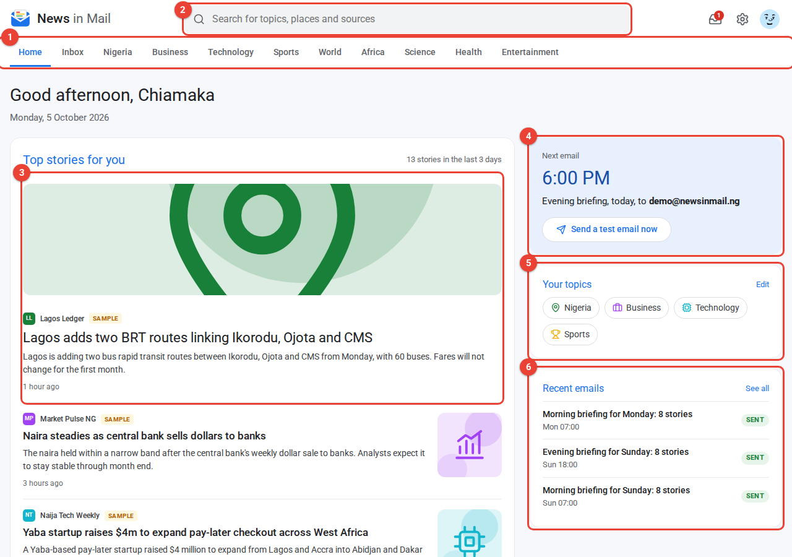

# News in Mail

Pick your interests and get a short, AI-summarized news briefing by email every morning and evening. The stories come from free RSS news feeds, and the UI is styled like Google News.

**Live demo:** https://news-in-mail-production.up.railway.app
**Demo login:** `demo@newsinmail.ng` / `demo1234` (already filled in on the sign-in page)



## Features

- Email and password accounts (bcryptjs and a signed JWT in an HTTP-only cookie)
- Onboarding: pick topics, morning and evening times, and a time zone. A test email is sent as soon as you finish.
- Live stories from 20 free feeds (BBC, The Guardian, Al Jazeera, TechCrunch, Premium Times, Punch, Channels TV, Vanguard)
- AI summaries through OpenRouter (Claude Sonnet 5.5, with Gemini Flash as fallback), cached per story. Without a key, the app falls back to the first sentences of each story.
- A scheduler sends each briefing once, in the reader's own time zone. A unique database index blocks duplicates.
- Story selection uses only the reader's topics and stories from the last 36 hours, never repeats a story, and spreads picks across topics.
- An inbox records every briefing as sent, failed or skipped, and shows the exact email
- Home, topic tabs, search and settings, all of which work on phones

Full documentation with annotated screenshots: [`docs/News-in-Mail-Documentation.pdf`](docs/News-in-Mail-Documentation.pdf)

## Quick start

```bash
service postgresql start
sudo -u postgres psql -c "CREATE DATABASE newsinmail;" -c "CREATE DATABASE newsinmail_test;" -c "CREATE DATABASE newsinmail_e2e;"

cp .env.example .env     # set DATABASE_URL, SESSION_SECRET, OPENROUTER_API_KEY
npm install
npm run db:migrate
npm run db:seed          # demo users, sample stories, email history
npm run ingest           # optional: pull live stories now
npm run dev              # http://localhost:3000
```

Behind an HTTP proxy, start Node with `NODE_USE_ENV_PROXY=1` so `fetch` uses it.

## Scripts

| Script | What it does |
| --- | --- |
| `npm run dev` | Development server |
| `npm run build` / `npm start` | Production build and server |
| `npm run start:railway` | Migrate, seed if empty, then start (used on Railway) |
| `npm run db:generate` | Create a new SQL migration from `src/db/schema.ts` |
| `npm run db:migrate` | Apply migrations (creates the database if missing) |
| `npm run db:seed` | Reset and load demo data dated relative to today |
| `npm run ingest` | Fetch all RSS feeds now |
| `npm test` | Vitest unit and integration tests |
| `npm run test:e2e` | Playwright end-to-end tests (desktop and mobile). Run `npm run build` first |
| `npm run docs:pdf` | Rebuild the PDF documentation and screenshots. Run `npm run build` first |
| `npm run lint` / `npm run typecheck` | ESLint and TypeScript |

## Environment variables

| Variable | Purpose |
| --- | --- |
| `DATABASE_URL` | Postgres connection string |
| `SESSION_SECRET` | Signs session cookies (16+ characters) |
| `OPENROUTER_API_KEY` | Turns on AI summaries |
| `OPENROUTER_MODEL`, `OPENROUTER_FALLBACK_MODEL` | Optional model overrides |
| `SMTP_URL`, `MAIL_FROM` | Optional real email delivery. Without them, emails go to the in-app inbox |
| `NEWSINMAIL_TODAY` / `NEWSINMAIL_NOW` | Pin the date (`YYYY-MM-DD`) or exact time for demos and tests |
| `NEWSINMAIL_SCHEDULER` | `on` runs the scheduler in development, `off` disables it |
| `NEWSINMAIL_OFFLINE` | `1` skips feeds and AI calls (tests) |
| `CRON_SECRET` | Enables `POST /api/cron` to run the scheduler on demand |

## Tests

- 52 unit tests and 9 integration tests (Vitest, with the integration tests running against real Postgres)
- 14 desktop and 2 mobile end-to-end tests (Playwright)

## Project layout

```
src/lib/        pure business rules (schedule, ranking, email, text, validation)
src/server/     database access, ingest, AI, delivery, digest service, seed
src/app/        pages, server actions, /api/health, /api/cron
src/proxy.ts    route protection
drizzle/        SQL migrations
tests/          Vitest unit and integration tests
e2e/            Playwright tests
docs/generator/ PDF documentation generator
```

## Deployment

The app runs on Railway, deploying from `main`. `railway.json` sets the build to `npm run build`, starts with migrate, seed-if-empty, then `next start -H 0.0.0.0`, and health-checks `/api/health`, which also pings the database.
